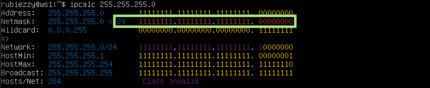
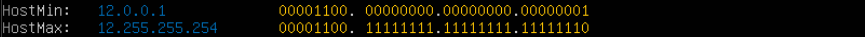
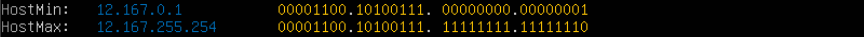

## Part 1. Инструмент **ipcalc**

**== Задание ==**

**Определить и записать в отчёт:**
##### 1) адрес сети  _192.167.38.54/13_:
###### `192.160.0.0`

##### 2.1) перевод маски _255.255.255.0_ в префиксную и двоичную запись:
###### Префиксная: `/24`
###### Двоичная `11111111.11111111.11111111.00000000`

##### 2.2) _/15_ в обычную и двоичную
###### Обычная: `255.254.0.0`
###### Двоичная `11111111.11111110.00000000.00000000`

##### 2.3) _11111111.11111111.11111111.11110000_ в обычную и префиксную
ipcalc не умеет переводить из бинарной записи в обычную, поэтому считаем самостоятельно
###### Обычная: `255.255.255.240`
###### Префиксная: `/28` 

##### 3) минимальный и максимальный хост в сети _12.167.38.4_ при масках: 
- ##### _/8_:
 
- ##### _11111111.11111111.00000000.00000000_:

 - ##### _255.255.254.0_:

- ##### _/4_:
 

