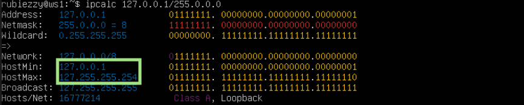
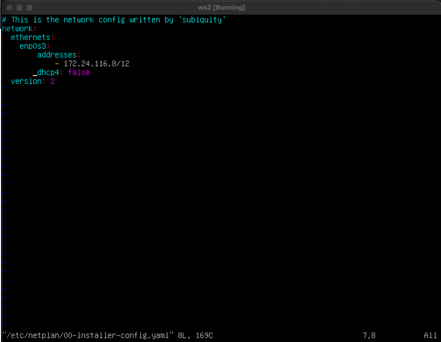
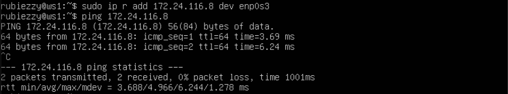

  

## Part 1. Инструмент ****ipcalc****

****== Задание ==****
##### Поднять виртуальную машину (далее -- ws1)
##### Установлена Ubuntu Server версии 20.04

  
#### 1.1. Сети и маски
##### Определить и записать в отчёт:

##### 1) адрес сети  __192.167.38.54/13__:

######  `192.160.0.0`

  

##### 2.1) перевод маски __255.255.255.0__ в префиксную и двоичную запись:

###### Префиксная: `/24`

###### Двоичная `11111111.11111111.11111111.00000000`

  

##### 2.2) __/15__ в обычную и двоичную

###### Обычная: `255.254.0.0`

###### Двоичная `11111111.11111110.00000000.00000000`

##### 2.3) __11111111.11111111.11111111.11110000__ в обычную и префиксную

ipcalc не умеет переводить из бинарной записи в обычную, поэтому считаем самостоятельно

###### Обычная: `255.255.255.240`

###### Префиксная: `/28`

##### 3) минимальный и максимальный хост в сети __12.167.38.4__ при масках:

- ##### __/8__:

- ##### __11111111.11111111.00000000.00000000__:

- ##### __255.255.254.0__:

- ##### __/4__:

#### 1.2. localhost

##### Определить и записать в отчёт, можно ли обратиться к приложению, работающему на localhost, со следующими IP:  _194.34.23.100_,  _127.0.0.2_,  _127.1.0.1_,  _128.0.0.1_

###### Сначала узнаем минимальный и максимальный хосты, которые могут работать на localhost

Зная host range мы можем сказать, что к адресам _127.0.0.2_,  _127.1.0.1_ мы `сможем обратиться`, а к _128.0.0.1_, _194.34.23.100_ - нет

#### 1.3. Диапазоны и сегменты сетей

##### Определить и записать в отчёт:

##### 1) какие из перечисленных IP можно использовать в качестве публичного, а какие только в качестве частных:  _10.0.0.45_,  _134.43.0.2_,  _192.168.4.2_,  _172.20.250.4_,  _172.0.2.1_,  _192.172.0.1_,  _172.68.0.2_,  _172.16.255.255_,  _10.10.10.10_,  _192.169.168.1_

Диапазоны частных адресов: 
1.  10.0.0.0/8 (всё что начинается на 10.);
2.  172.16.0.0/12 (с 172.16.0.0 по 172.31.255.255 включительно);
3.  192.168.0.0/16 (с 192.168.0.0 по 192.168.255.255 включительно).

##### `Частные адреса:` _10.0.0.45_, _10.10.10.10_, _192.168.4.2_, _172.20.250.4_ , _172.16.255.255_ , _10.10.10.10_
##### `Публичные адреса:` _134.43.0.2_ , _172.0.2.1_ , _192.172.0.1_ , _172.68.0.2_ , _192.169.168.1_

##### 2) какие из перечисленных IP адресов шлюза возможны у сети _10.10.0.0/18_: _10.0.0.1_, _10.10.0.2_, _10.10.10.10_, _10.10.100.1_, _10.10.1.255_

###### Узнаем минимальный и максимальный хосты для сети:

Возможны адреса, которые находятся в этом диапазоне, т. е.: _10.10.0.2_, _10.10.10.10_

## Part 2. Статическая маршрутизация между двумя машинами
**== Задание ==**

##### 1) Поднять две виртуальные машины (далее -- ws1 и ws2)
###### Устанавливаем второй Ubuntu Server

##### 2) С помощью команды `ip a` посмотреть существующие сетевые интерфейсы
###### ws1:

###### ws2:

##### 3) Описать сетевой интерфейс, соответствующий внутренней сети, на обеих машинах и задать следующие адреса и маски: ws1 - _192.168.100.10_, маска _/16_, ws2 - _172.24.116.8_, маска _/12_
###### Изменяем `etc/netplan/00-installer-config.yaml` для
###### ws1:

###### ws2:

###### Выполняем команду `netplan apply` для
###### ws1:

###### ws2:

#### 2.1. Добавление статического маршрута вручную

##### Добавить статический маршрут от одной машины до другой и обратно при помощи команды вида  `ip r add`  и пропинговать соединение между машинами для
###### ws1:

###### ws2:

#### 2.2. Добавление статического маршрута с сохранением

##### 1) Перезапустить машины
###### Делаем reboot обеих машин

##### 2) Добавить статический маршрут от одной машины до другой с помощью файла  _etc/netplan/00-installer-config.yaml_ для 
###### ws1:

###### ws2:

##### 3) Пропинговать соединение между машинами
###### ws1:

###### ws2:

## Part 3. Утилита **iperf3**
#### 3.1. Скорость соединения
##### Перевести и записать в отчёт: 
8 Mbps = 1 MB/s  
100 MB/s = 819200 Kbps  
1 Gbps = 1024 Mbps  

#### 3.2. Утилита  **iperf3**
##### Измерить скорость соединения между ws1 и ws2
###### ws1 используем как сервер, запускаем на ней команду `iperf3 -s` 

###### ws2 используем как клиент, запускаем на ней команду `iperf3 -c 192.168.100.10` 

## Part 4. Сетевой экран

#### 4.1. Утилита  **iptables**

##### Создать файл  _/etc/firewall.sh_, имитирующий фаерволл, на 
###### ws1:

###### ws2:

##### Запустить файлы на обеих машинах командами `chmod +x /etc/firewall.sh` и `/etc/firewall.sh` 

###### ws1:

###### ws2:

После запуска скрипта мы видим, что машина ws2, в отличие от ws1, не получает никаких сообщений от ws1 при ping

Cоответственно, echo reply на ws1 остался заблокирован, хотя последним правилом в ее списке iptables было правило accept. 

Из этого можно сделать вывод, что более приоритетным правилом в конфигурации iptables будет первое правило, а противоречащие ему правила учитываться не будут.

#### 4.2. Утилита  **nmap**

##### Командой  **ping**  найти машину, которая не "пингуется", после чего утилитой  **nmap**  показать, что хост машины запущен
###### На предыдущем пункте мы уже поняли, что не пингуется ws1, с ws2 можно установить соеднинение:

###### Поверяем при помощи map, что машина запущена:

